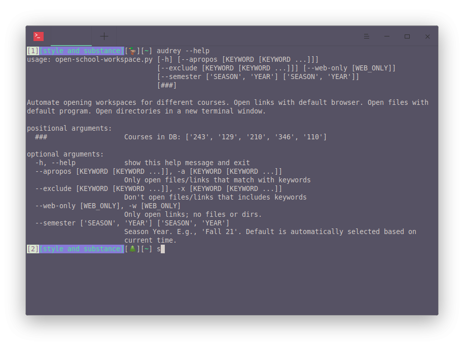

# Automated Workspaces

- Define different workspaces [in a json file](./workspaces.json) -- e.g., for each different college course you are currently enrolled in
- Add URLs, PDFs, documents, programs, directories to each workspace under the categories defines in the example json file
- Create an alias for script and easily open new workspaces with shell

shoutout Christina Applegate

